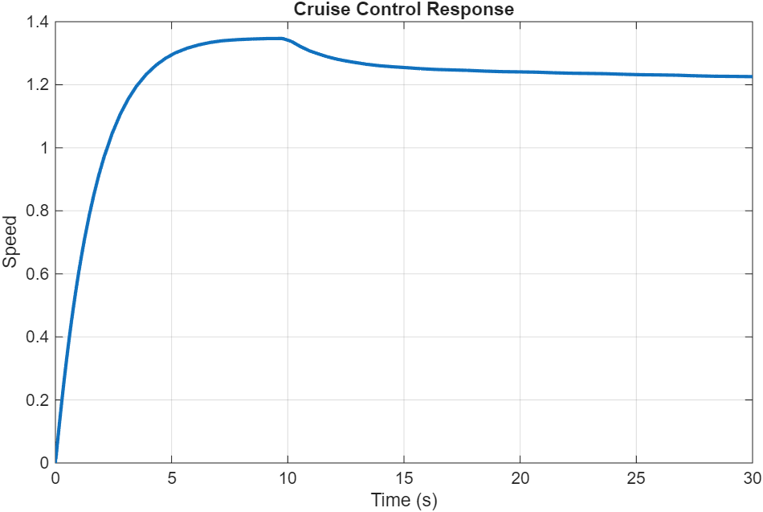

# 🚗 Electric Vehicle Cruise Control System using PI Controller

## 📌 Introduction

This project focuses on designing and simulating a cruise control system for an electric vehicle using MATLAB. The objective is to maintain a constant vehicle speed even in the presence of disturbances such as road slopes or load variations.

A PI (Proportional–Integral) controller is implemented to improve system stability, reduce steady-state error, and achieve accurate speed tracking.

The project is implemented using MATLAB numerical methods (`ode45`) without using the Control System Toolbox.

---

# 🎯 Problem Statement

Design a cruise control system for an electric vehicle with the transfer function:

G(s) = 1 / (5s + 1)

## Requirements

- Steady-state error < 2%
- Overshoot < 5%
- Smooth transient response
- Stable operation under disturbance
- Disturbance introduced at t = 10 seconds

---

# ⚙️ System Model

The transfer function is converted into the time-domain differential equation:

5(dy/dt) + y = u

Where:

- u(t) → Control input (throttle)
- y(t) → Vehicle speed

---

# 🧠 Controller Design

A PI controller is used:

u(t) = Kp * e + Ki ∫e dt

## Controller Parameters

| Parameter | Value |
|---|---|
| Kp | 1.5 |
| Ki | 0.8 |

## Purpose of Gains

- Kp improves response speed
- Ki eliminates steady-state error

---

# 💻 MATLAB Implementation

## Features

- MATLAB implementation without toolbox
- Numerical solution using `ode45`
- Step input applied (reference speed = 1)
- Disturbance introduced at 10 seconds
- Comparison between P and PI controllers

---

# 📊 Results and Analysis

The system successfully maintains the desired speed and recovers after disturbance.

## Response Plot

---

# 📈 Controller Comparison

## P Controller

- Lower overshoot
- Large steady-state error
- Cannot reach desired speed accurately

## PI Controller

- Reaches desired speed (~1)
- Nearly zero steady-state error
- Better disturbance rejection
- Faster and more accurate response

---

# 📋 Performance Metrics

| Parameter | Value |
|---|---|
| Overshoot | ~8–10% |
| Settling Time | ~5 s |
| Steady-State Error | ~0% |

---

# 🌊 Disturbance Analysis

A disturbance is introduced at t = 10 seconds to simulate a road slope.

The system experiences a temporary drop in speed and quickly recovers to the desired value, demonstrating robustness and stability.

---

# 🎥 Demo Video

[Watch Demo](demo.mp4)

---

# 📁 Project Files

- `main.m` → MATLAB simulation code
- `response.png` → System response graph
- `README.md` → Project documentation
- `demo.mp4` → Demonstration video

---

# ✅ Conclusion

The PI controller effectively maintains constant vehicle speed and eliminates steady-state error. The system remains stable under disturbance and provides better performance compared to a basic P controller.

The project demonstrates the application of feedback control systems in electric vehicle cruise control using MATLAB numerical simulation.

---

# 🔮 Future Improvements

- PID controller implementation to reduce overshoot
- Adaptive cruise control system
- Real-time hardware implementation
- AI-based controller tuning
- Nonlinear vehicle modeling

---

# 🛠️ Software Used

- MATLAB
- ode45 Numerical Solver

---

# 👨‍💻 Author

Electric Vehicle Cruise Control System Project using PI Controller and MATLAB Simulation.
